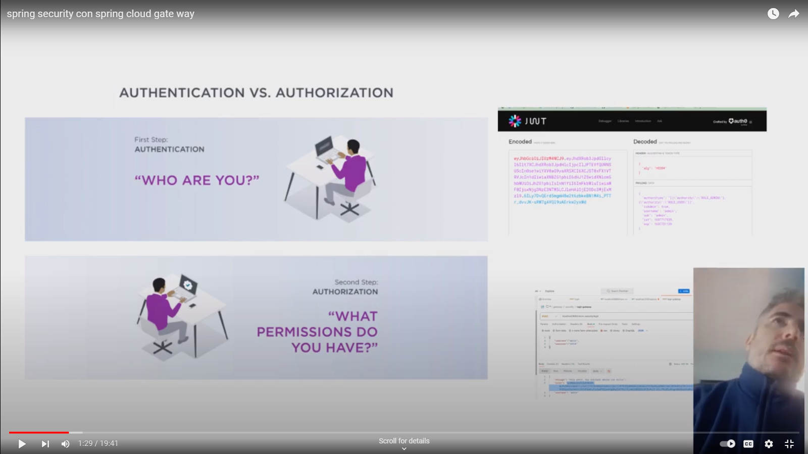
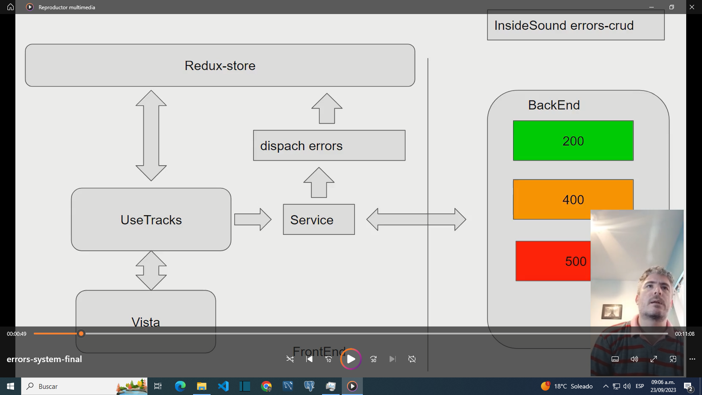
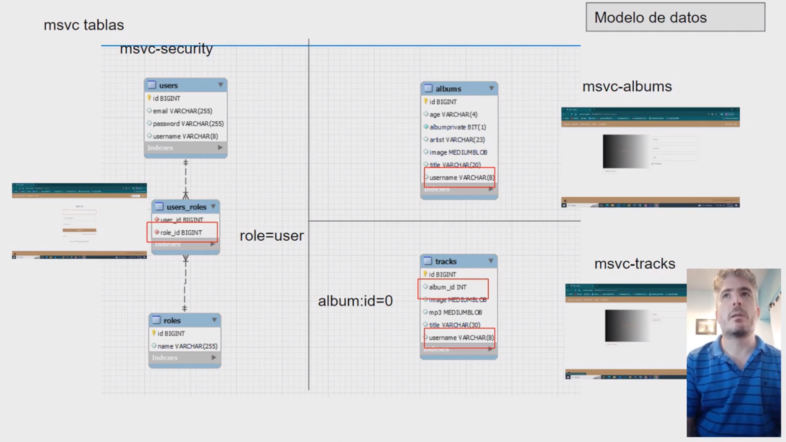
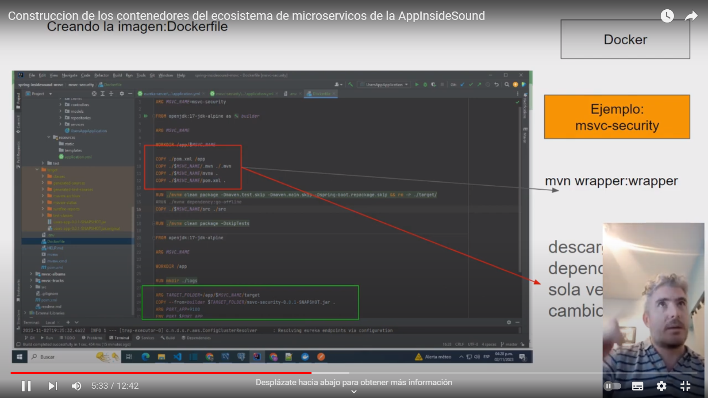
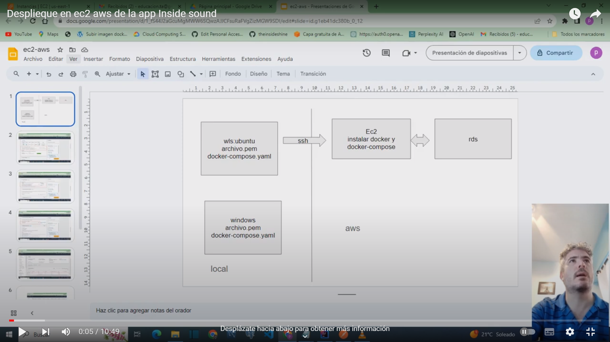
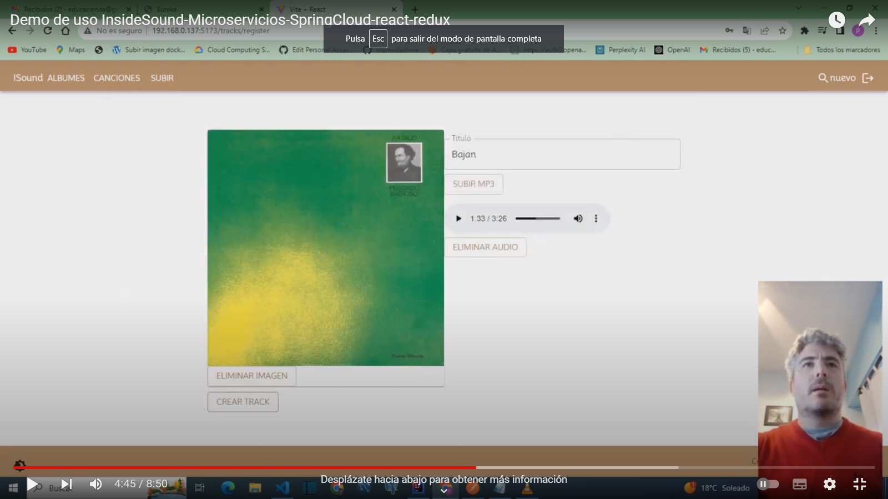

 This project is under construction

InsideSound is an application to create albums with songs to listen to.

The project is divided into the following parts:
1) Evaluation of the graphical interface and ecosystems of uS -branch master
2) Kubernetes deployment evaluation-branch K8s
3) Migration of the ecosystems to a monolithic service that meets the design recommendations-branch monolithic-backend
[notes](doc/recomendaciones.pdf)

In each branch you will be able to see the progress of the stages in videos.

Spring Security and Spring Cloud Gateway

Springsecurity implementation notes
[notes](doc/noteImpl.pdf)

ErrorSystem

DataModel

Construction of the containers of the microservices ecosystem of the InsideSound App, added environment variables, arguments,
and images were uploaded to dockerHub built through layers in the Dockerfile

Docker implementation notes
[notes](doc/insideSound-docker.pdf)

Deployment of the inside sound app in aws

Ec2 implementation notes
[notes](doc/ec2-aws.pdf)

Demo-stage1

FrontEnd repository: https://github.com/theinsideshine/react-insideSound
