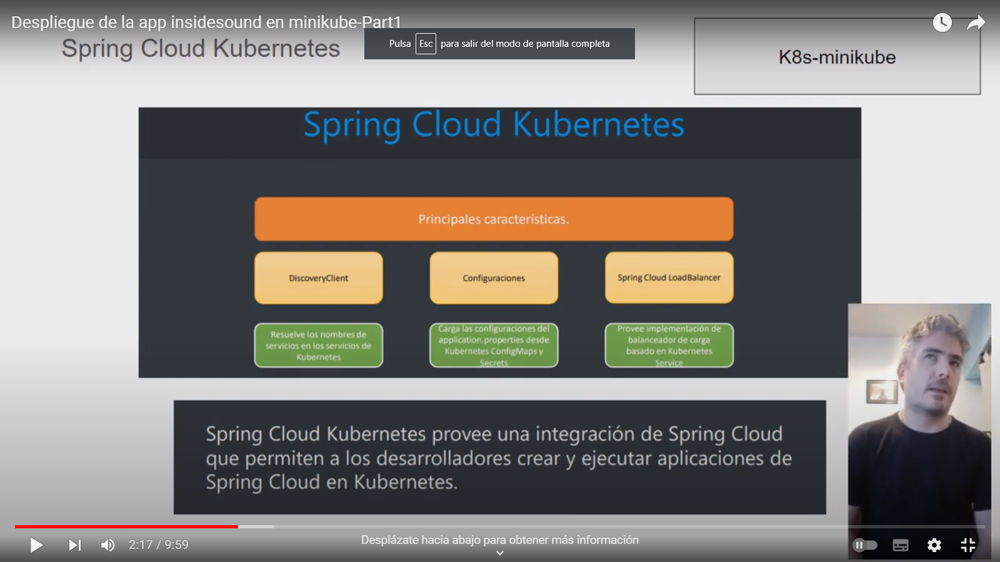
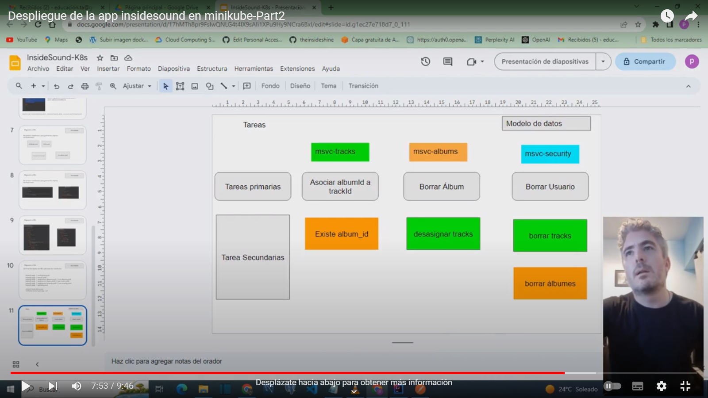

 This project is under construction

InsideSound is an application to create albums with songs to listen to.

The project is divided into the following parts:
1) Evaluation of the graphical interface and ecosystems of uS -branch master
2) Kubernetes deployment evaluation-branch K8s
3) Migration of the ecosystems to a monolithic service that meets the design recommendations-branch monolithic-backend

In each branch you will be able to see the progress of the stages in videos.

Deploy in minikube-part1

Deploy in minikube-part2

FrontEnd repository: https://github.com/theinsideshine/react-insideSound
