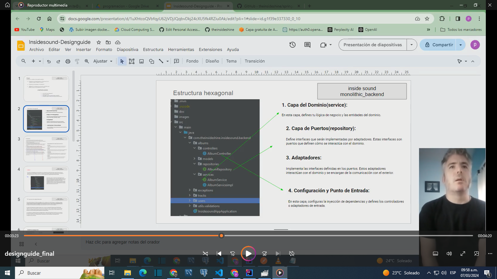
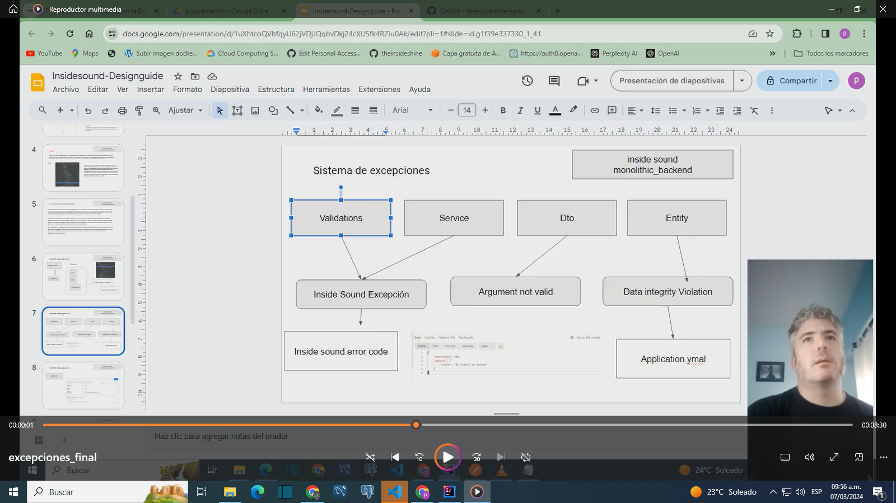

This project is under construction 

InsideSound is an application to create albums with songs to listen to.

The project is divided into the following parts:
1) Evaluation of the graphical interface and ecosystems of uS 
   -branch master https://github.com/theinsideshine/springcloud-insidesound/tree/master
2) Kubernetes deployment evaluation 
   -branch K8s https://github.com/theinsideshine/springcloud-insidesound/tree/K8s
3) Migration of the ecosystems to a monolithic service that meets the design GUidelines -branch monolithic-backend
[Guidelines](doc/recomendaciones.pdf)

In each branch you will be able to see the progress of the stages in videos.

Design guideline

   Use hexagonal architecture.
   Solid Alid Principles
   DTO object has to be completely immutable.   

[Exceptions](doc/excepcionesjava.pdf)
[Designguide](doc/Insidesound-Designguide.pdf)

ISound.Migration of the ecosystems to a monolithic service that meets the design guidelines-Part 1

ISound.Migration of the ecosystems to a monolithic service that meets the design guidelines-Part 2

FrontEnd repository: https://github.com/theinsideshine/react-insideSound